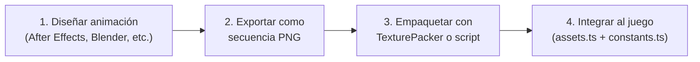
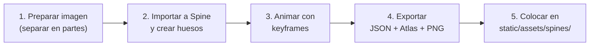

# Guía para Diseñador: Creación de Animaciones y Assets Visuales

## Contexto

Este proyecto es un SDK para juegos de casino tipo slot. Cada elemento visual del juego puede tener animaciones — desde los símbolos del tablero hasta los fondos, transiciones y UI. Esta guía explica las herramientas, formatos y workflow para crear cualquier tipo de animación.

---

## Qué se puede animar

### Símbolos del tablero
Cada símbolo tiene **6 estados visuales**, y cada uno puede tener su propia animación:

| Estado | Cuándo se muestra | Ejemplo de animación |
|--------|-------------------|---------------------|
| `static` | Reposo en el tablero | Idle sutil (respiración, brillo leve) |
| `spin` | Durante el giro de reels | Desenfoque, compresión vertical |
| `land` | Al detenerse el reel | Rebote, impacto, partículas al aterrizar |
| `win` | Combinación ganadora | Animación destacada, glow, partículas |
| `postWinStatic` | Después de ganar | Versión iluminada del símbolo |
| `explosion` | Al destruirse (tumble) | Desintegración, explosión de partículas |

### Otros elementos animables

| Elemento | Archivo actual | Descripción |
|----------|---------------|-------------|
| **Background base** | `spines/foregroundAnimation/` | Fondo animado del juego base |
| **Background free spins** | `spines/foregroundFeatureAnimation/` | Fondo animado durante free spins |
| **Big Win / Epic Win / etc.** | `spines/bigwin/` | Celebración por premios grandes |
| **Transición** | `spines/transition/` | Transición entre juego base y free spins |
| **Free Spin Intro/Outro** | `spines/fsIntro/` | Pantallas de inicio/fin de free spins |
| **Anticipation** | `spines/anticipation/` | Tensión antes de resultado (brillo en reel) |
| **Marco del tablero** | `sprites/reelsFrame/` | Marco que enmarca los reels |
| **Multiplicador global** | `spines/globalMultiplier/` | Animación del marco de multiplicador |
| **Monedas** | `sprites/coin/` | Lluvia de monedas en premios |
| **Loader** | `spines/loader/` | Pantalla de carga |

---

## Especificaciones Técnicas

| Parámetro | Valor |
|-----------|-------|
| **Tamaño de símbolos** | 200 × 200 px |
| **Tamaño de fondos** | 2039 × 1000 px (landscape) |
| **Formato final** | Spine JSON 4.2 **o** Spritesheet JSON (PixiJS) |
| **Duración animaciones de símbolo** | 0.5 – 2.0 segundos |
| **Fondo** | Transparente (alpha) en símbolos |
| **Motor de renderizado** | PixiJS v8 + pixi-svelte |
| **Spine runtime** | `@esotericsoftware/spine-pixi-v8` v4.2.74 |

---

## Opción A: Sprite Sheet Animation (Recomendada — Sin costo)

Secuencia de frames empaquetados en un spritesheet. Es el enfoque más simple y compatible.

### Programas

| Programa | Costo | Ideal para |
|----------|-------|------------|
| **[Adobe After Effects](https://www.adobe.com/products/aftereffects.html)** | Suscripción Creative Cloud | Animaciones premium con partículas, glows, distorsiones |
| **[DaVinci Resolve Fusion](https://www.blackmagicdesign.com/products/davinciresolve)** | Gratis | Composición motion graphics profesional |
| **[Blender](https://www.blender.org/)** | Gratis | Efectos 3D renderizados a 2D, partículas |
| **[Aseprite](https://www.aseprite.org/)** | $20 (o gratis compilando desde [GitHub](https://github.com/aseprite/aseprite)) | Animación frame-by-frame estilo hand-drawn |
| **[Piskel](https://www.piskelapp.com/)** | Gratis, online | Animaciones simples rápidas |
| **[Wick Editor](https://www.wickeditor.com/)** | Gratis, online | Animación tipo Flash |
| **[Krita](https://krita.org/)** | Gratis | Pintura digital + timeline de animación |

### Workflow



### Paso 1: Crear la animación

Abrir tu programa preferido y animar el elemento. Ideas por estado de símbolo:

| Estado | Ideas de animación |
|--------|--------------------|
| **static** | Brillo sutil pulsante, leve flotación, partículas ambientales lentas |
| **spin** | Motion blur vertical, compresión/estiramiento, estela de color |
| **land** | Rebote elástico, ondas de impacto, micro-partículas al tocar |
| **win** | Animación protagonista — glow intenso, partículas, escala dramática |
| **postWinStatic** | Versión iluminada/dorada del símbolo |
| **explosion** | Desintegración, fragmentos volando, onda expansiva |

### Paso 2: Exportar frames

- Resolución: **200 × 200 px** por frame
- Formato: **PNG con transparencia**
- Nombrar: `frame_001.png`, `frame_002.png`, ... `frame_024.png`
- FPS recomendado: **24-30 fps** → para 1 segundo = 24-30 frames
- Mantener el símbolo **centrado** en cada frame

### Paso 3: Empaquetar el spritesheet

Usar [TexturePacker](https://www.codeandweb.com/texturepacker) (tiene versión libre con limitaciones) o [ShoeBox](https://renderhjs.net/shoebox/) (gratis):

1. Importar todos los frames PNG
2. Configurar:
   - **Data Format**: JSON (Array) — compatible con PixiJS
   - **Texture Format**: WebP o PNG
   - **Algorithm**: MaxRects
   - **Allow trim**: Sí
   - **Allow rotation**: No (más fácil para debug)
3. Exportar: genera `animacion_h1.json` + `animacion_h1.webp`

### Paso 4: Integrar al juego

Entregar al desarrollador los archivos `.json` + `.webp`. Se integran así:

```typescript
// assets.ts — agregar la animación
H1_WIN: {
  type: 'spriteSheet',
  src: new URL('../../assets/sprites/winAnims/h1_win.json', import.meta.url).href,
},

// constants.ts — apuntar el win state al spritesheet animado
H1: {
  win: { type: 'spriteSheet', assetKey: 'H1_WIN', sizeRatios: { width: 1, height: 1 } },
  // ...otros estados quedan igual
}
```

---

## Opción B: Spine Animation (Más potente — Requiere licencia)

Animación skeletal donde se mueven "huesos" que deforman la imagen. Produce animaciones más suaves con menos tamaño de archivo.

### Programas

| Programa | Costo | Compatibilidad |
|----------|-------|----------------|
| **[Spine Editor](https://esotericsoftware.com/)** | $70 (Essential) / $340 (Pro) | ✅ Nativa — el SDK usa Spine 4.2 |
| **[DragonBones](http://dragonbones.com/en/index.html)** | Gratis | ⚠️ Necesita converter a Spine JSON |
| **[Creature Animation](http://www.kestrelmoon.com/creature/)** | $60+ | ⚠️ No directamente compatible |

> [!IMPORTANT]
> Si se usa Spine, **debe ser versión 4.2** para ser compatible con el runtime del SDK.

### Workflow con Spine Editor



### Paso 1: Preparar la imagen

Separar el símbolo en **partes que se moverán independientemente**. Ejemplo para el Pincel (H1):

```
pincel/
├── cuerpo.png       ← El mango del pincel
├── cerdas.png       ← Las cerdas/pelo
├── brillo.png       ← Efecto de brillo (overlay)
├── particula_1.png  ← Gota de pintura 1
├── particula_2.png  ← Gota de pintura 2
└── glow.png         ← Resplandor de fondo
```

> [!TIP]
> Cuantas más partes separes, más fluida será la animación. Pero cada parte añade complejidad. Para símbolos low-pay (manchas), 2-3 partes son suficientes.

### Paso 2: En Spine Editor

1. **Crear proyecto** → importar las imágenes como attachments
2. **Crear huesos** (bones) para cada parte articulada
3. **Vincular** cada imagen a su hueso
4. **Animar**: crear una animación (ej. `h1_win`) con keyframes de:
   - Posición, rotación, escala de cada hueso
   - Alpha/opacidad de los slots
   - Colores (tinting)

### Paso 3: Exportar

- **Format**: JSON
- **JSON Version**: 4.2
- **Pack atlas**: Sí
- **Image format**: WebP (o PNG)
- El export genera 3 archivos:
  - `symbols_new.json` — skeleton data
  - `symbols_new.atlas` — atlas de texturas
  - `symbols_new.webp` — textura empaquetada

### Paso 4: Integrar

Colocar los archivos en `static/assets/spines/symbols/` y actualizar:

```typescript
// assets.ts
H1: {
  type: 'spine',
  src: {
    atlas: new URL('../../assets/spines/symbols_new/symbols_new.atlas', import.meta.url).href,
    skeleton: new URL('../../assets/spines/symbols_new/h1.json', import.meta.url).href,
    scale: 2,
  },
},

// constants.ts
H1: {
  win: { type: 'spine', assetKey: 'H1', animationName: 'h1_win', sizeRatios: { width: 0.5, height: 0.5 }},
  // ...
}
```

---

## Comparación Rápida

| Aspecto | Sprite Sheet | Spine |
|---------|-------------|-------|
| **Costo** | Gratis | $70+ |
| **Curva de aprendizaje** | Baja (usa herramientas que ya conocés) | Media-alta |
| **Tamaño archivo** | Grande (muchos frames) | Pequeño (solo huesos + texturas) |
| **Calidad animación** | Depende de FPS y frames | Muy suave (interpolación) |
| **Flexibilidad runtime** | Fija (lo que exportaste es lo que se ve) | Alta (se puede mezclar, pausar, etc.) |
| **Recomendación** | Empezar con esto ✅ | Migrar después para calidad premium |

---

## Checklist de Entrega

Para cada animación, entregar:

- [ ] Spritesheet: `[nombre].json` + `[nombre].webp`
  — **O** Spine: `[nombre].json` + `[nombre].atlas` + `[nombre].webp`
- [ ] Tamaño de frame correcto (200×200 para símbolos)
- [ ] Fondo transparente (para símbolos y overlays)
- [ ] Indicar si la animación es **loop** o **one-shot**:
  - `static`, `spin`: loop (se repite continuamente)
  - `land`, `win`, `explosion`: one-shot (se reproduce una vez)
  - Fondos, anticipation: loop
  - Big Win, transiciones, intro/outro: one-shot
- [ ] Para one-shots: que el último frame sea una pose limpia (transición suave al estado siguiente)
- [ ] Nombre del asset y el estado al que corresponde (ej: `Pincel_win`, `Brocha_land`)
